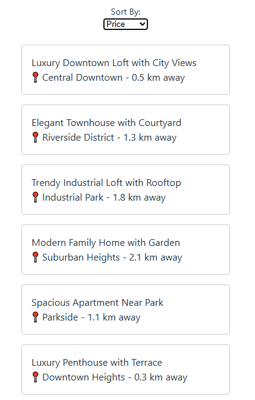

# Rental Finder




A full‑stack project for discovering housing rental listings. The
application consists of two separate codebases:

* **Server** – a Node.js/Express API that scrapes rental websites,
  persists results in MongoDB, and exposes retrieval endpoints. It
  includes comprehensive unit/integration tests and cron tasks to
  periodically refresh data.
* **Client** – a React single‑page application (built with Vite) that
  consumes the API and presents filters, sorting, and pagination to
  the user.

Accessories include a collection of static `mock-websites/` HTML pages
used by the scraper during testing.

---

## 🚀 Features

* Web scraping support for multiple rental websites with configurable
  CSS selectors
* MongoDB persistence with full CRUD operations and pagination
* Express API with health check and listings endpoints
* React front‑end offering filtering by ZIP/sort and pagination
* Batch utilities and cron scheduling for automated data refresh
* Fully tested server components (430+ tests) using Vitest and
  mongodb-memory-server

---

## 🧱 Architecture & Directory Layout

```
.
├── client/              # React/Vite front end
│   ├── public/          # Static assets
│   └── src/             # React components, helpers, styles
│       ├── js/          # `fetch-library`, `utils-library`
│       ├── sections/    # Filters, ListingsGrid, Pagination
│       └── components/  # Reusable UI bits (NavBtn, etc.)
├── mock-websites/       # Sample HTML for scraping tests
└── server/              # API backend
    ├── chron/           # Scheduled/cron jobs
    ├── config/          # Environment configuration files
    ├── controls/        # HTTP request handlers (controllers)
    ├── models/          # Mongoose schemas & DB operations
    └── utils/           # Scraper, batch helpers, selectors
```

> The front‑end and back‑end are independent projects and maintain their
> own `package.json` with the scripts shown below.

---

## 🛠 Prerequisites

* [Node.js](https://nodejs.org) 18+ (works on Windows, macOS, Linux)
* [MongoDB](https://www.mongodb.com) running locally or accessible via
  a connection string

> The server uses `MONGO_URI` from `server/config/.env`. By default it
> points to `mongodb://localhost:27017/rentalfinder`.

---

## 📦 Installation & Setup

### Clone the repository

```bash
git clone https://github.com/roc2246/rental-finder.git
cd rental-finder
```

### Server

```bash
cd server
npm install
# create config/.env (see example below)
```

Example `config/.env`:
```
MONGO_URI=mongodb://localhost:27017/rentalfinder
PORT=3000
```

### Client

```bash
cd ../client
npm install
```

---

## ▶️ Running the Application

### Start the Server

In `server/`:

```bash
npm run dev        # restarts automatically on file changes
# or
node index.js      # plain node startup
```

Server listens on the port defined in `.env` (default 3000). The
frontend is configured (via Vite proxy) to forward `/api` calls to the
same origin.

Endpoints:
* `GET /` – simple greeting
* `GET /health` – `{ status: "ok" }`
* `GET /api/rentals` and `/api/listings` – fetch listings with query
  params (filters, page, pagesize, sort)

Query parameters can be provided as JSON objects or strings, e.g.
`?filters={"city":"Boston"}&page=2&sort={"price":-1}`.

### Start the Client

In `client/`:

```bash
npm run dev
```

Open `http://localhost:5173` (default Vite port); the app will
communicate with the server endpoint to retrieve rental data.

---

## ✅ Testing

The server contains a comprehensive test suite managed by Vitest.  To
execute:

```bash
cd server
npm test          # run all tests
npm test -- --watch
npm test -- server/models/__tests__/CRUD.test.js

# coverage report
npm test -- --coverage
```

Tests cover models, controllers, utilities, and the entry point.  Many
mocked HTML pages under `mock-websites/` support scraper tests.

The client project currently does not include automated tests and
relies on manual QA using Vite's dev server.

---

## 🧪 Development Workflow

1. **Server changes**:
   * Add or update models (`server/models/*`). Write corresponding tests.
   * Build controllers in `server/controls/` to expose new API
     behavior; test them.
   * Update `server/utils` for reusable logic or scraping enhancements.
   * Make sure `server/chron/index.js` schedules any recurring jobs.

2. **Client changes**:
   * Modify filters, grid, or pagination under `client/src/sections`.
   * Use `fetch-library.js` and `utils-library.js` to call the backend.
   * Add new UI components to `client/src/components`.
   * Run `npm run lint` and review behavior in the browser.

3. Commit, push, and open pull requests. Code review should include
   verifying tests pass and manual smoke testing of the UI.

---

## 📄 Additional Documentation

* **Server docs** – see `server/SERVER.md` for in‑depth server
  architecture and API details.
* **Testing notes** – `server/TESTING-GUIDE.md` summarizes the test
  coverage.
* **Server configuration** – environment variables and how the cron
  scheduler works.

---

## 📌 License & Contribution

This project is authored by **Riley Childs** and released under the ISC
license. Please file issues or pull requests via
https://github.com/roc2246/rental-finder.

---

> **Tip:** You can inspect the mock HTML files in `mock-websites/` to
> understand the structure expected by the scraper.  When adding new
> sites, update `server/utils/site-dir.js` with appropriate selectors.

---

Thanks for exploring Rental Finder! Feel free to reach out with
questions or improvements. 😊
